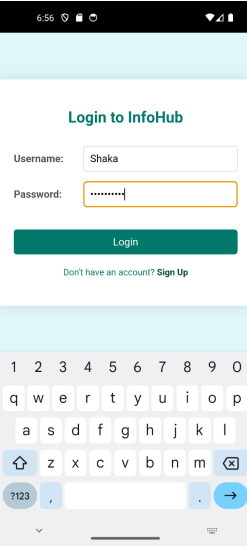
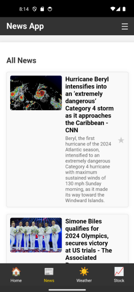

# InfoHub

InfoHub is a web view application designed to provide users with real-time updates across three distinct APIs: news, weather, and stock trends. The application offers a comprehensive dashboard for users to stay informed about current events, weather forecasts, and stock market performance.

## Features

### Web API Integration

#### News API
- Real-time news updates from various sources
- Ability to search for specific news topics
- Feature to favorite articles for later reference
- Timestamped favorites for chronological organization

#### Weather API
- Location-based weather forecasts using GPS
- Visual representation of weather data using charts
- Historical weather data for comparison
- Average temperature calculations

#### Stock API
- Up-to-date stock price information
- Interactive charts for visualizing stock trends
- List of trending stocks
- Latest financial news

### Data Manipulation and Visualization

- **News API Data**: Filtering, sorting, and timestamp management
- **Weather API Data**: Historical data handling and forecast aggregation
- **Stock API Data**: Real-time updates and graphical representation using Chart.js

### User Authentication

- Secure user signup and login functionality
- Credentials stored in localStorage
- Personalized experience with saved preferences

## Technologies Used

- HTML5, CSS3, JavaScript
- Chart.js for data visualization
- Moment.js for date formatting
- LocalStorage for data persistence
- External APIs for news, weather, and stock data

## Screenshots

### Sign Up Page


### Login Page


### Home Page


### News Page


### Favorites Page


### Weather Page


### Stock Page


## Installation and Setup

1. Clone the repository:
```
git clone https://github.com/yourusername/InfoHub.git
```

2. Navigate to the project directory:
```
cd InfoHub
```

3. Open the `index.html` file in your browser to start the application.

## Usage

1. Sign up for a new account or log in with existing credentials
2. Browse the latest news on the home page
3. Search for specific weather forecasts by location
4. Track stock trends and view financial news
5. Favorite news articles for later reference

## Project Structure

```
InfoHub/
├── www/
│   ├── css/
│   ├── js/
│   ├── img/
│   ├── index.html        # Sign up page
│   ├── login.html        # Login page
│   ├── home.html         # Home dashboard
│   ├── news.html         # News page
│   ├── weather.html      # Weather forecast
│   ├── stock.html        # Stock trends
│   ├── stockData.html    # Detailed stock information
│   └── favourite.html    # Favorited news articles
```

## Future Enhancements

- Push notifications for breaking news
- Dark mode support
- Expanded stock portfolio tracking
- Weather alerts for severe conditions
- Cross-device synchronization

## Acknowledgements

- News API for providing real-time news data
- Weather API for accurate weather forecasts
- Stock API for current market information
- Chart.js and Moment.js for enhanced functionality 